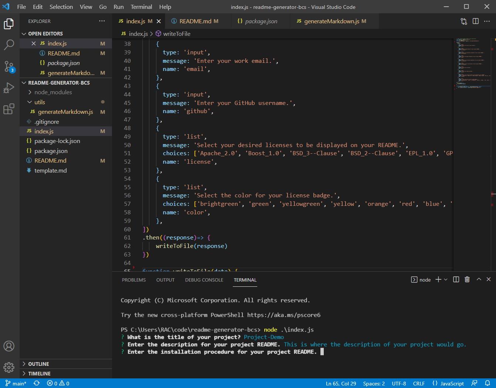
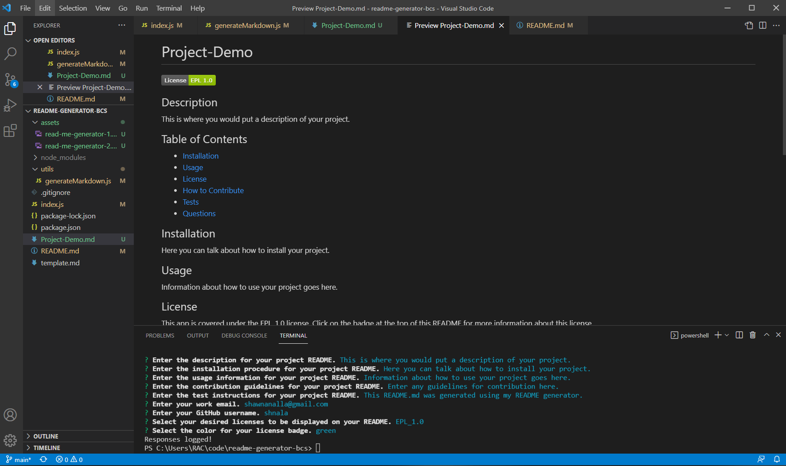

# readme-generator-bcs

  ## Description
  
  This app generates README.md files based on input from the user in the command line. README files are critical
  tools for developers, allowing them to describe their app or project via an organized, succinct and easy-to-access text
  file. However, they can be a pain to create sometimes, especially when your primary focus is towards the project itself. Use this README generator to quickly generate a markdown file based on inputs that you supply through the command line on VS code. It will format all of your responses neatly into a professional-looking README file, removing the hassle from your workflow and allowing you to focus more on the important things.
  
  ## Table of Contents
  - [Installation](#installation)
  - [Usage](#usage)
  - [How to Contribute](#contributing)
  - [Tests](#tests)
  - [Questions](#questions)
  - [License](#license)
  
  
  ## Installation
  
  To install this app, clone the repository from (https://github.com/shnala/readme-generator-bcs) and then run NPM install on the index.js file. This will download the modules necessary for the app to function. Currently, this app only uses the inquirer module.

  You may refer to this video tutorial for a step-by-step walkthrough if you're stuck! (https://youtu.be/N9hfD7rM3Uk)
  
  ## Usage
  
  To use this app, open index.js from the cloned repo. Open the integrated terminal on index.js and then enter "node ./index.js" on the command line and a series of prompts will appear. Type in your response to each prompt and hit enter. Once you've gone through all the prompts, a README file based on your answers will appear in the same folder.

  
  
  
  ## Contributing
  
  Anyone can contribute. See the #questions tab below for my contact information.
  
  ## Tests
  
  Try testing the generator by entering simple answers for the prompts that appear. This will give you a feel for how the app functions. 
  
  ## Questions
  
  Have any questions? Reach out to me via email, (shawnanalla@gmail.com), and I will get back to you as soon as I can.
  
  Check out my repo in the mean time: (https://github.com/shnala)

  ## License

  MIT License

Copyright (c) [2022] [Shawn Analla]

Permission is hereby granted, free of charge, to any person obtaining a copy
of this software and associated documentation files (the "Software"), to deal
in the Software without restriction, including without limitation the rights
to use, copy, modify, merge, publish, distribute, sublicense, and/or sell
copies of the Software, and to permit persons to whom the Software is
furnished to do so, subject to the following conditions:

The above copyright notice and this permission notice shall be included in all
copies or substantial portions of the Software.

THE SOFTWARE IS PROVIDED "AS IS", WITHOUT WARRANTY OF ANY KIND, EXPRESS OR
IMPLIED, INCLUDING BUT NOT LIMITED TO THE WARRANTIES OF MERCHANTABILITY,
FITNESS FOR A PARTICULAR PURPOSE AND NONINFRINGEMENT. IN NO EVENT SHALL THE
AUTHORS OR COPYRIGHT HOLDERS BE LIABLE FOR ANY CLAIM, DAMAGES OR OTHER
LIABILITY, WHETHER IN AN ACTION OF CONTRACT, TORT OR OTHERWISE, ARISING FROM,
OUT OF OR IN CONNECTION WITH THE SOFTWARE OR THE USE OR OTHER DEALINGS IN THE
SOFTWARE.